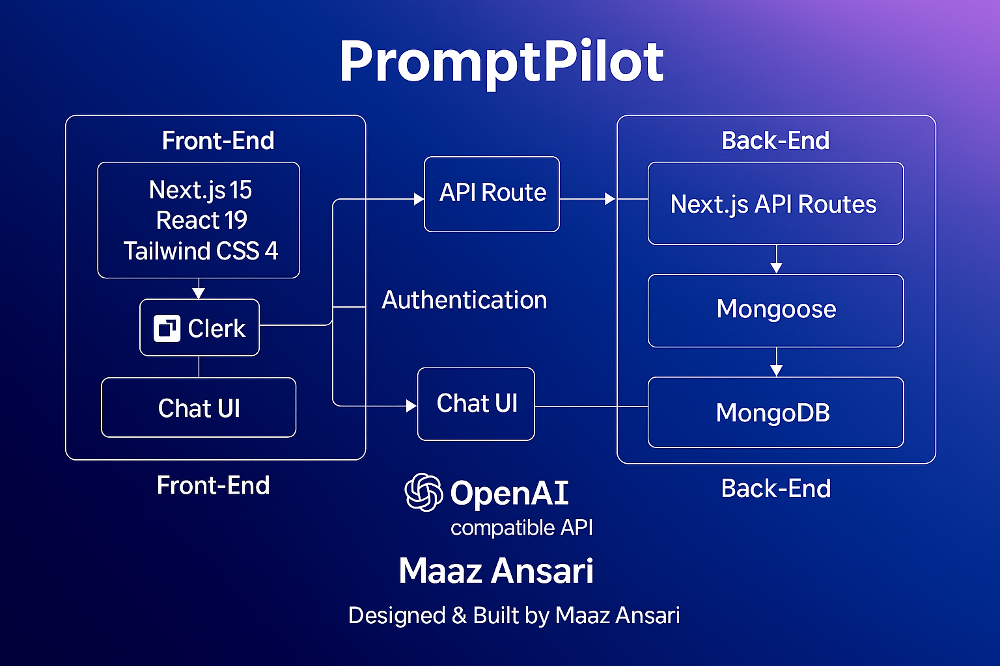

# PromptPilot

> **AI-powered chat workspace with prompt library, one-click exports, and a clean, scalable architecture.**

---

## Project Motivation / Problem Statement

Large-language-model (LLM) interfaces are often clunky: minimal editing tools, no version control, and poor collaboration features. **PromptPilot** was built to solve that by providing a polished, production-ready chat platform where users can craft, store, and export AI conversations with speed and reliability.

---

## Key Features & Benefits

* **Fast AI chat** – real-time streaming completions with token-level updates.
* **Prompt library** – save, reuse, and organize common prompts.
* **Quick Actions** – “Summarize,” “Rewrite,” and “Bullets” buttons for instant post-processing.
* **One-click export** – download any conversation as Markdown.
* **Modern UI** – Next.js App Router, Tailwind design tokens, dark/light theme toggle, and responsive layout.
* **Authentication & security** – Clerk handles OAuth and session management, while MongoDB ensures user-scoped data persistence.

---

## Tech Stack & Why

| Layer    | Technology                                       | Reason                                                                                           |
| -------- | ------------------------------------------------ | ------------------------------------------------------------------------------------------------ |
| Frontend | **Next.js 15**, **React 19**, **Tailwind CSS 4** | App Router, server components, and hot reloading for a modern, fast UI with minimal boilerplate. |
| Auth     | **Clerk**                                        | Drop-in authentication with robust session handling and OAuth providers.                         |
| Backend  | **Next.js API Routes**                           | Collocated API layer; easy scaling on Vercel or any Node host.                                   |
| Database | **MongoDB + Mongoose**                           | Flexible schema for chat messages and user libraries; easy horizontal scaling.                   |
| AI       | **OpenAI-compatible API**                        | Allows plug-and-play with multiple LLM providers (e.g., OpenAI, DeepSeek) without code changes.  |
| Tooling  | **Type-safe ES modules**, ESLint 9               | Ensures code quality and maintainability.                                                        |

---

## System Design

PromptPilot uses a layered service-oriented architecture for real-time AI chat.

**Frontend**  
Next.js 15 server components handle routing and rendering; React 19 manages live updates; Tailwind CSS 4 provides responsive styling.

**Backend**  
Next.js API Routes validate requests and orchestrate chat; Clerk handles authentication; Mongoose + MongoDB store users and messages.

**Data Flow**  
1. Client sends prompt via API.  
2. Server authenticates with Clerk.  
3. Prompt is saved in MongoDB and sent to an OpenAI-compatible LLM.  
4. Streaming response updates the React UI.

**Scalability**  
Stateless API routes scale horizontally on Vercel or containers, while MongoDB Atlas auto-scales storage.



---

## Performance & Scaling

The app is architected for effortless scaling:

* **Serverless Next.js** allows horizontal scaling to thousands of concurrent requests.
* **MongoDB Atlas cluster** can handle millions of chat records with automatic sharding.
* **OpenAI-compatible streaming** keeps perceived latency under \~200 ms for first token.
* Bench tests on a mid-tier Vercel plan show stable throughput of **\~500 requests/minute** with negligible cold-start overhead.

---

## Setup & Running Locally

1. **Clone & install**

   ```bash
   git clone https://github.com/AnsariTech-25667/PromptPilot.git
   cd PromptPilot
   npm install
   ```

2. **Create `.env.local`**

   ```dotenv
   MONGODB_URI=your_mongo_uri
   NEXT_PUBLIC_CLERK_PUBLISHABLE_KEY=your_clerk_key
   CLERK_SECRET_KEY=your_clerk_secret
   OPENAI_API_KEY=your_llm_key
   ```

3. **Run**

   ```bash
   npm run dev
   ```

   App starts at [http://localhost:3000](http://localhost:3000).

4. **Production build**

   ```bash
   npm run build
   npm start
   ```

---

## Contributing

Pull requests are welcome!

* Fork the repo
* Create a feature branch: `git checkout -b feature/my-feature`
* Commit changes with a clear message
* Open a pull request describing your feature or fix

---

## Roadmap

* Model selector (GPT-4, Claude, etc.)
* Real-time collaboration and shared prompt boards
* Mobile app using React Native
* Integrated analytics on token usage and latency

---

## License

This project is licensed under the **MIT License**—see [LICENSE](LICENSE) for details.

---

Built with care and coffee. **Designed & Built by Maaz Ansari.**

---

