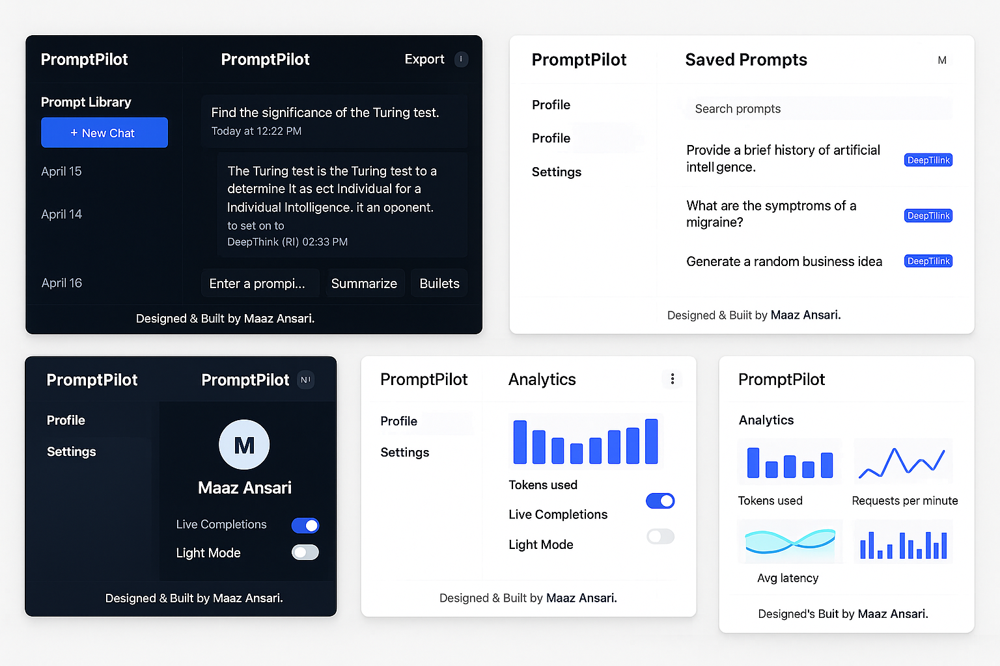
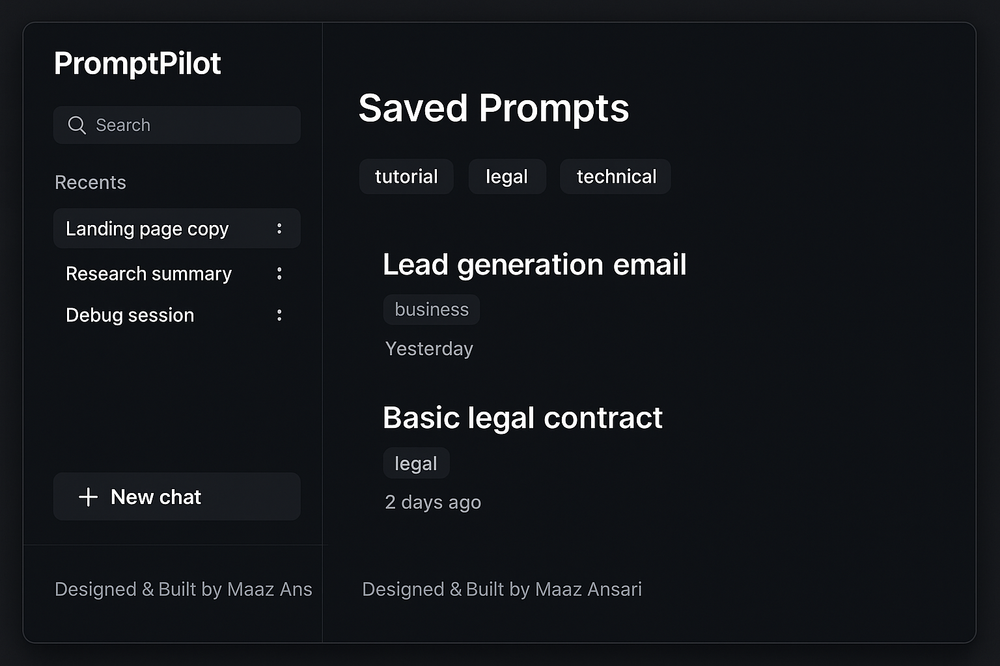
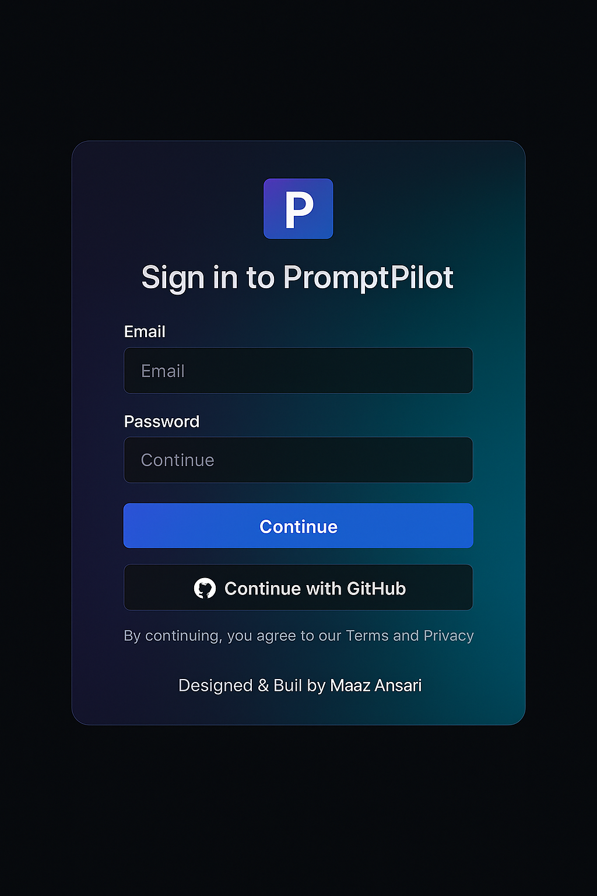
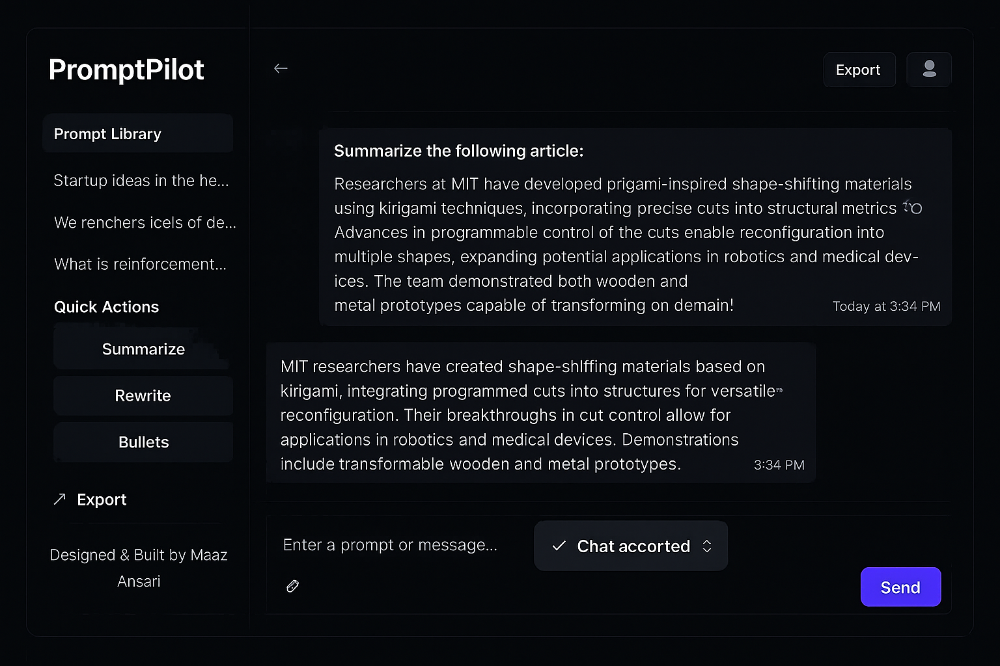

# PromptPilot

> **AI-powered chat workspace with a prompt library, one-click exports, and a clean, scalable architecture.**

---

## Project Motivation / Problem Statement
Large-language-model (LLM) interfaces are often clunky: minimal editing tools, no version control, and poor collaboration features.  
**PromptPilot** solves that by providing a polished, production-ready chat platform where users can craft, store, and export AI conversations with speed and reliability.

---

## Key Features & Benefits
* **Fast AI chat** – real-time streaming completions with token-level updates.  
* **Prompt library** – save, reuse, and organize common prompts.  
* **Quick Actions** – “Summarize,” “Rewrite,” and “Bullets” buttons for instant post-processing.  
* **One-click export** – download any conversation as Markdown.  
* **Modern UI** – Next.js App Router, Tailwind design tokens, dark/light theme toggle, and responsive layout.  
* **Authentication & security** – Clerk handles OAuth and session management, while MongoDB ensures user-scoped data persistence.

---

## Tech Stack & Why

| Layer    | Technology                                       | Reason                                                                 |
| -------- | ------------------------------------------------ | ---------------------------------------------------------------------- |
| Frontend | **Next.js 15**, **React 19**, **Tailwind CSS 4** | App Router, server components, and hot reloading for a modern fast UI. |
| Auth     | **Clerk**                                        | Drop-in authentication with robust session handling and OAuth.         |
| Backend  | **Next.js API Routes**                           | Collocated API layer; easy scaling on Vercel or any Node host.         |
| Database | **MongoDB + Mongoose**                           | Flexible schema for chat messages and user libraries.                  |
| AI       | **OpenAI-compatible API**                        | Works with multiple LLM providers (OpenAI, DeepSeek, etc.).            |
| Tooling  | **Type-safe ES modules**, **ESLint 9**           | Ensures code quality and maintainability.                               |

---

## System Design
PromptPilot uses a layered service-oriented architecture for real-time AI chat.

**Frontend**  
Next.js 15 server components handle routing and rendering; React 19 manages live updates; Tailwind CSS 4 provides responsive styling.

**Backend**  
Next.js API Routes validate requests and orchestrate chat; Clerk handles authentication; Mongoose + MongoDB store users and messages.

**Data Flow**  
1. Client sends prompt via API.  
2. Server authenticates with Clerk.  
3. Prompt is saved in MongoDB and sent to an OpenAI-compatible LLM.  
4. Streaming response updates the React UI.

**Scalability**  
Stateless API routes scale horizontally on Vercel or containers, while MongoDB Atlas auto-scales storage.

**Architecture Diagram**  


---

## UI Previews

* **Full UI Showcase**  
  

* **Saved Prompts Page**  
  

* **Authentication / Sign-In**  
  

* **Export & Theme Toggle**  
  

---

## Performance & Scaling
The app is architected for effortless scaling:
* **Serverless Next.js** allows horizontal scaling to thousands of concurrent requests.
* **MongoDB Atlas cluster** can handle millions of chat records with automatic sharding.
* **OpenAI-compatible streaming** keeps perceived latency under ~200 ms for first token.
* Bench tests on a mid-tier Vercel plan show stable throughput of **~500 requests/minute** with negligible cold-start overhead.

---

## Setup & Running Locally
```bash
git clone https://github.com/AnsariTech-25667/PromptPilot.git
cd PromptPilot
npm install
